# An attempt at demystifying graph deep learning

## Introduction

There are a ton of great explainers of what graph neural networks are.
However, I find that a lot of them go pretty deep into the math pretty quickly.
Yet, we still are faced with that age-old problem: where are all the pics??
As such, just as I had attempted with Bayesian deep learning,
I'd like to try to demystify graph deep learning as well,
using every tool I have at my disposal
to minimize the number of equations and maximize intuition using pictures.
Here's my attempt, I hope you find it useful!

## Graphs

In my [Network Analysis Made Simple tutorial][nams],
we see that the term "graph" are really nothing more than
a synonym for networks.
Defined strictly, graphs are comprised of **nodes**, i.e.
entities, and **edges** that define _relations_ between nodes.
Examples are social networks (nodes = people, edges = friendship),
and flight networks
(nodes = airports, edges = flights that exist between the two networks).

Pictorially, we'd usually draw something that looks like this:

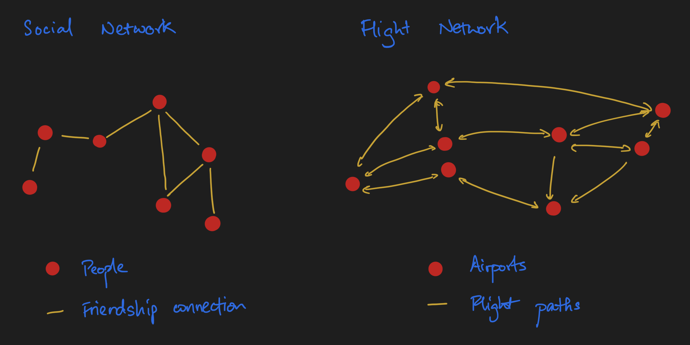

A graph $G$, in really concise mathematical notation, can be represented as $G = (V, E)$, or in plain English, an unordered collection of vertices (a synonym for nodes) and an unordered collection of edges.

## Graphs as _arrays_

One thing that's a really neat property of graphs is that we can actually represent them as _arrays_.
This is covered in the [Linear Algebra section][linalg] of [Network Analysis Made Simple][nams]; I also wrote about this in the earlier sections of an essay I wrote on [message passing][msg] I'd encourage you to check it out in its entirety, but nonetheless here's a simplified version to introduce you to the key ideas.

[nams]: https://ericmjl.github.io/Network-Analysis-Made-Simple/index.html
[linalg]: https://ericmjl.github.io/Network-Analysis-Made-Simple/04-advanced/02-linalg/
[msg]: https://ericmjl.github.io/essays-on-data-science/machine-learning/message-passing/

Because graphs are comprised of nodes and edges, we need to figure out a way of representing them individually.
Coming up, we'll explore how this can be done.

### Representing nodes as arrays

Let's start with nodes, our entities.
Our nodes, being entities, may have certain properties.
Let's use a concrete example of molecules, which is what I would consider a minimally complex example for exploring key ideas.
(I use minimally complex examples as my anchoring examples to learn an idea, I hope this one is useful for you too!)

Imagine we have a molecule of ethanoic acid.
It's comprised of two carbons, two oxygen, and four hydrogens joined in the following fashion:

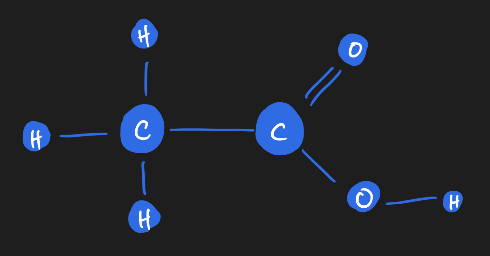

Each atom is a node, and edges are bonds between the atoms.
Each atom, or node, carries *properties* or *features* which can be represented on the array.
For example, there's the atomic mass (a floating point number, or integer if you desire to round it off).
There's the valence of the atom as well.
And many more! To keep things simple, I'll stick to just these two for now.
As you can see, you'll end up with a *vector of features* per node.
If we stack them up together, we get what we call a node feature matrix, which will become handy later.

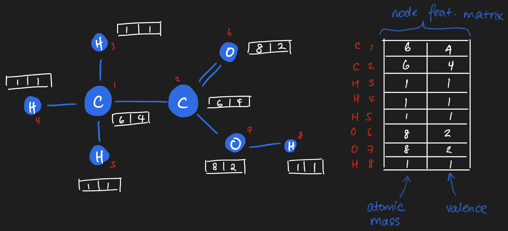

### Representing edges as arrays

Similarly, there is an array representation of edges too! If you imagine lining up all of the atoms inside the ethanoic acid molecule along a square matrix, you can fill in the square matrix based on whether an edge exists between those two atoms.
It'll look something like this:

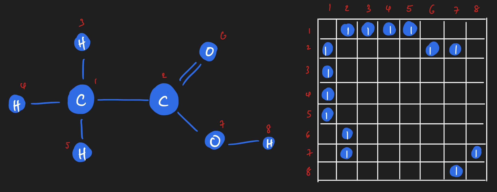

If we wanted to, though, we could get really granular!
We could have on adjacency matrix that shows us all of the single bonds,
and another adjacency matrix that shows all of the double bonds.
Or we could have an adjacency matrix that is *weighted*
based on the number of bonds between two atoms.

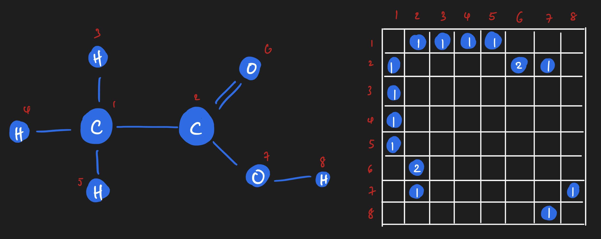

Those are all *perfectly valid representations* of the edges of a graph,
each with their own semantic meaning *and* tradeoffs
for whatever modelling problem you might have.

## Message Passing

It's now time to think about message passing.
Message passing is a very well-known operation
in the network science and machine learning worlds,
but you don't have to be intimidated about it!
At its core, it's actually really simple,
and you'll see that it totally has a linear algebra interpretation that,
in my opinion, is pretty elegant!

Let's start by defining what message passing on a graph is.

Message passing on a graph is kind of what you would intuit it to be:
if I have a message on a node, we want to pass the message to other nodes on the graph.
Our message can only travel along the edges, though - otherwise, the structure of the graph would be irrelevant.

Here's an example that is really, really simplified.
(We'll see the exact same ideas in action
on our ethanoic acid example in a short moment.)
This example is drawn from my tutorial on network analysis,
in particular, from the linear algebra section.

Let's say we have a directed chain graph of four nodes.
A "message" lives on the first node,
and we want to pass it through the graph.
In a first message passing iteration,
we take the message on the first node and pass it to the next one.
In the iteration after, we take the message and pass it to the next node.
So on and so forth until we reach the last node.
Here, there's no place the message can go;
regardless of how many more steps we might desire to run message passing,
the message won't go anywhere.

As it turns out, there's a linear algebra interpretation of message passing!
For the four node chain graph,
we can consider the message as being a property of a node.
For a node possessing the message,
or more generally a copy of the message,
we can assign it a value of 1.
If a node doesn't have a copy of the message,
then we assign it a value of 0.
Here's where the magic happens.
When we dot product the adjacency matrix against this message vector
(which is akin to our node feature vector),
the message will _move_ from the first node to the next node.
(Verify this point for yourself by hand!)

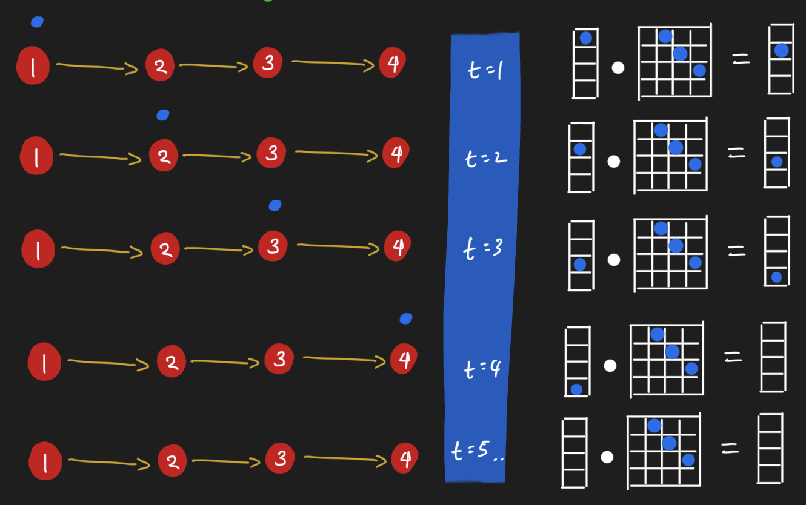

So it seems we can pass messages around nodes by simply doing dot products!
Let's see this in action by looking at the same operation in action
for ethanoic acid.
Here, all nodes receive messages from their neighbors simultaneously.
Notice how the graph looks like after performing message passing.
The carbon attached to three hydrogens has
a different value from the carbon attached to the oxygens;
their value is the sum of their neighbors.
"Summing up neighbors" is literally all that we are doing
in this form of message passing,
in other words,
when we do a dot product of the adjacency matrix with a node feature matrix.

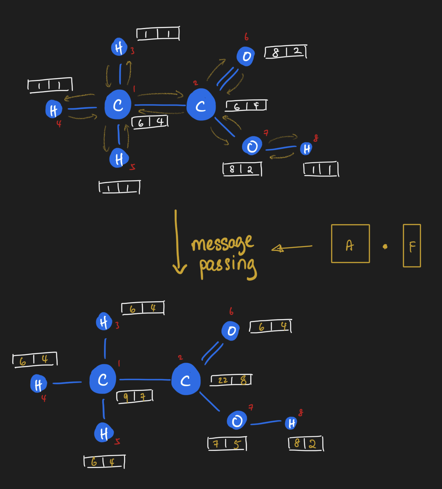

At this point, I'd encourage you to pause reading
and ponder over the ideas this far.
It was pretty mind-blowing for me when I first really made the connection
between message passing and linear algebra.
I spent a few good weeks mulling the ideas I just described.

## Message Passing + Neural Networks

We're now going to see how message passing gets embedded inside a neural network - a network that learns on network.
(Pretty meta, if you ask me!)

To anchor our understanding,
we will start with graph deep learning in a supervised learing setting,
where our learning task is to predict a scalar number
for every graph in a collection of graphs.
One classic example where this has been done before
is in chemical property prediction,
the first of which I encountered being a paper
by my deep learning teacher [David Duvenaud](https://www.cs.toronto.edu/~duvenaud/)
on [learning molecular fingerprints](https://arxiv.org/abs/1509.09292).
Here, each input into the neural network is a _graph_,
rather than a _vector_.
For comparison, classical deep learning starts with rows of i.i.d. data
that are fed through a neural network.

We know that neural networks are composed of chains of math functions.
(Really, that's all neural network models are at their core!)
Feed forward neural networks chain together dot products;
convolutional neural networks add in n-dimensional convolutions in the mix;
meanwhile, recurrent neural networks have lag as part of its structure.
Each of these provide *inductive biases*.
By the way, that term, in my opinion,
is nothing more than a fancy way of saying that
we encode prior knowledge of our data generating process
into the mathematical model.
In each case, though, on a per-i.i.d.
sample basis, we pass in one n-dimensional array at a time.

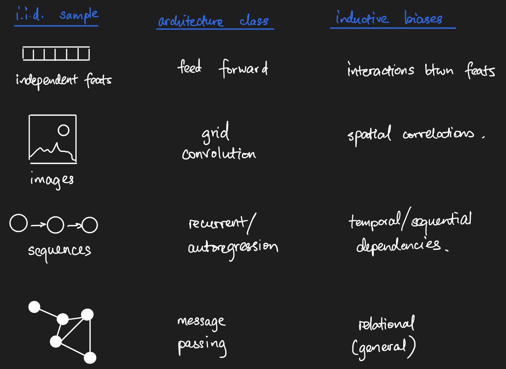

What about graph neural networks, then - what exactly does the input look like,
and what is the general structure of such networks?
To answer those questions,
we're going to walk through three different kinds of graph neural network layers,
the three that I'm most familiar with,
as specific examples of the general form of graph neural nets.
By the end of us walking through them,
we should have a much clearer grasp of the math that underlies these models.

### Message Passing Neural Networks (MPNNs)

Message passing neural networks, as the name implies,
means we inject _message passing_ as an operation in the neural network.
Let's see how we can define a message passing layer.
Instead of accepting just a vector or n-dimensional image,
the message passing layer accepts both the adjacency matrix
and the node feature matrix and performs one round of message passing.
But we know it's part of a _neural network_,
so where does the _neural_ piece come in?
Well, right after message passing,
we take the message-passed node feature matrix
and apply the equivalent of a feed-forward neural network operation -
linear transform + some activation function!

We can do this as many rounds as we desire -
though it's important to note that
we usually don't want to go for too many rounds.
The long story cut short is that
message passing has the effect of smoothing out node-level information,
which _could_ become undesirable.

Once we have done one or two rounds of message passing,
it might be desirable to have a vector representation of our graphs.
But at the moment, we're stuck with two matrices -
the adjacency matrix and the messaged-passed node feature matrix!
Well, one canonical way of creating graph-level vector representations
is to simply take a node-wise summation (or average) of the node feature matrix.
Summations express that the size of a graph matters,
while averages express that size should not matter.
What you choose will depend on your particular problem.
By the way, you as long as you have a reductive function
that takes the node feature matrix and reduces it to a vector,
you can satisfy the need to have a vector summary of a graph...
as long as you can explain the semantics :).
Regardless, let's call this layer a "graph summary layer".

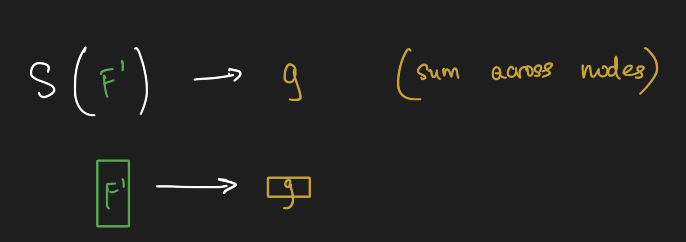

Once we have a vector-level representation of our graph, we can stick on classical feed forward neural network layers on top of the graph processing layers to obtain the thing we're trying to predict.

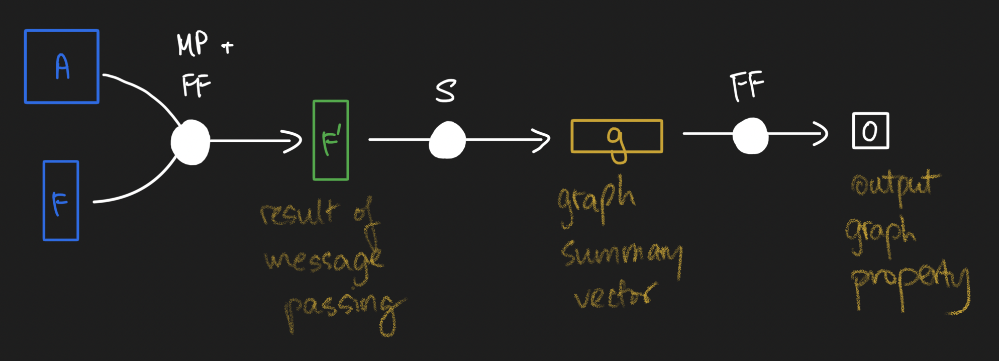

And that, my friends, is how a classical message passing neural network works! Here's the framework I use to remember how GNNs work:

1. Message passing operations, followed by
2. Graph summarization operations, followed by
3. Feed forward networks to predict output.

In the broader machine learning framework of "model, loss, optimizer",
all we've worked on here is to design a *model*
that fits the kind of data that we have.
You get to keep constant the *loss* and the *optimizer*.
Keep this framework memorized,
and use MPNNs as the anchoring minimally complex example,
and everything else we discuss coming will become crystal clear!

### Graph Laplacian Networks

So what's up with graph laplacian networks? Well, really, at its core is all that's been done here is to *replace each graph's adjacency matrix with their graph Laplacian matrix*.
That's it! Every other operation that you see in the pictures above remain the same.

But what is the graph Laplacian? At its core, it's a measure of the local _derivative_ of the graph, and we use it when we want to express that local differences in nodes matter to our graph-level property of interest.
To explain this idea here any further would distract from our exploration of GNNs, so I would refer you to [the Wikipedia entry](https://en.wikipedia.org/wiki/Laplacian_matrix) for those of you who desire a deeper understanding of this category of graph matrices.

### Graph Attention Networks

What about graph attention networks, then? Well, we know that the attention mechanism is nothing more than an operation that uses a neural network inside a neural network to learn weights of *some* kind.
With graph attention networks, we use an embedded neural network to learn a per-graph adjacency-like matrix operator that we mask over with the adjacency matrix, which effectively gives us an edge attention matrix for message passing.

And that's it! Everything else about the model can stay constant.

Graph attention layers give us the most general message, data-driven passing operator that we can imagine.
Rather than fix the message passing operator _a priori_, we simply learn the operator in a data-driven fashion.

### General form of graph neural networks

Okay, so we've explored three examples of graph neural networks.
What exactly is general here? Here's the answer:

1. We must have a message passing operator, $A$.
It can be learned or it can be provided _a priori_ and remain fixed throughout the neural network.
You basically have the freedom to define any form of $A$ that you need!
2. We need to have node feature matrices, $F$.
3. For convenience, we usually transform our graphs' array representations $A$ and $F$ into a summary vector that then gets processed by a feed forward neural network.

Again, what remains relatively constant is the _structure_ of the model - some form of generalized message passing followed by some form of graph summarization followed by a top model.
As long as you have some sort of semantically-meaningful square matrix $A$ and a semantically-meaningful node feature matrix $F$, you can follow the message passing -> summarization -> feed forward structure to build your GNN models.

## MPNNs and convolution operations

When David taught me about graph neural networks, one idea really clicked: how message passing generalizes the grid convolution to graphs - which is why the "graph convolution" term shows up in the deep learning literature.
Let's explore how this is the case by looking carefully at a simple grid convolution and a simple graph convolution.

Starting off with the simplest grid convolution, let's say we have a 5x5 pixel image with a 3x3 convolution operator comprised of $1$s everywhere except the middle cell.
When using the convolution operation (with certain border settings), we get the following result:

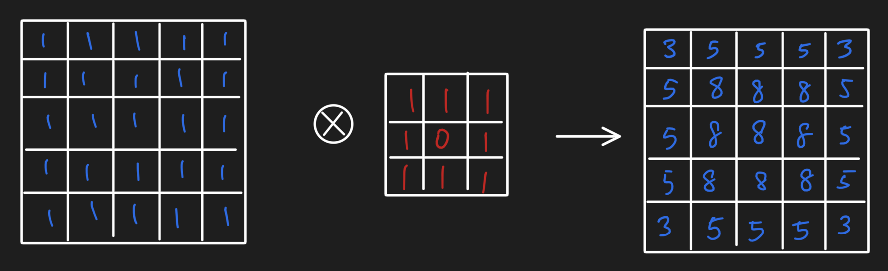

We actually can re-represent the grid of values as a lattice graph and do a message passing operation to obtain the same result:

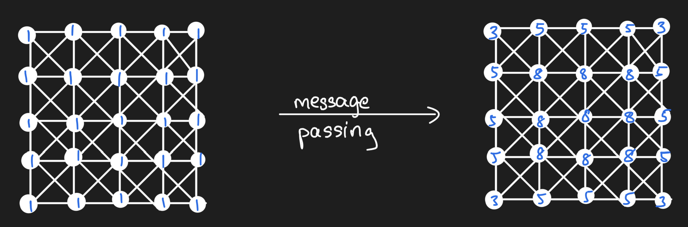

And in doing so, we thus can see that the message passing operation using the adjacency matrix as our message passing operator is equivalent to convolution with a convolution filter of 1s surrounding a zero.
Message passing on graphs more generally simple requires that we relax the condition that our graph be a lattice graph!

## Graph learning tasks

Thus far, we explored how graph neural networks work in the context of a supervised machine learning problem where we want to build a model that links graphs as inputs to a property of the entire graph.
Beyond this single learning task, though, there are other learning tasks.
From a talk that my friend [Chris Lin](https://www.linkedin.com/in/chris522229197/) delivered, I learned that there are a few primary categories of graph learning tasks.
Here's a short overview of those learning tasks.

### Graph-level prediction

This is the category of problem we leveraged above to explore the internals of graph neural networks.
Basically we frame the problem as "given graph, predict number".
It assumes that we have a bunch of i.i.d.
data that have a natural graph structure as its representation.

### Node labelling

This category of problems typically deals with one large graph and its adjacency matrix, and our desired output is a label (or a suite of labels) that need to be annotated on nodes.
Some of the nodes have labels while others don't; message passing could be handy here because it encodes the *homophily* assumption - that is, for problems where we expect that similar things will be linked together, we can encode this inductive bias into our models much more naturally than other structural equations.

### Edge presence/absence prediction

This is another class of problems where usually we are given one large graph, and the desired output is either whether an edge ought to exist between two nodes.
This can be framed in terms of predicting the entries of the graph adjacency matrix, for example.

## Summary

Here, we started with array representations of single graphs.
Then, we covered the message passing operation,
which is a key operation in graph neural networks.
We explored how we can compose message passing, graph summarization,
and feed forward neural networks to do graph-level property prediction.
Finally, we did a quick tour through the general categories
of graph learning tasks in which graph neural networks are used.

It's taken me 2-3 months of procrastination, brainstorming,
and more to write all of this down, and even then,
I doubt I have comprehensively covered
all of the fundamentals of graph deep learning.
That said, I believe that in this essay,
we've given ourselves a great starting point -
you might even say, a launchpad -
for delving into the vast swathe of literature out there.

## With Thanks

I would like to give special thanks to my Patreon supporters,
Alejandro, Rafael, Fazal, Brian, Hector, Carol, and Eddie.
With the new kid, switching roles, and more of life hitting me in the face,
it's taken a bit of time for me to get this essay out,
but I'm finally glad to have it done!
