```python
%load_ext autoreload
%autoreload 2
%config InlineBackend.figure_format = 'retina'
```


```python
import pymc3 as pm
```

# Markov Models From The Bottom Up, with Python

Markov models are a useful class of models for sequential-type of data.
Before recurrent neural networks (which can be thought of as an upgraded Markov model) came along,
Markov Models and their variants were _the in thing_ for processing time series and biological data.

Just recently, I was involved in a project with a colleague, Zach Barry,
where we thought the use of autoregressive hidden Markov models (AR-HMMs) might be a useful thing.
Apart from our hack session one afternoon, it set off a series of self-study that culminated in this essay.
By writing this down for my own memory, my hope is that it gives you a resource to refer back to as well.

You'll notice that I don't talk about inference (i.e. inferring parameters from data) until the end: this is intentional.
As I've learned over the years doing statistical modelling and machine learning,
nothing makes sense without first becoming deeply familiar with the "generative" story of each model,
i.e. the algorithmic steps that let us generate data.
It's a very Bayesian-influenced way of thinking that I hope you will become familiar with too.

## Markov Models: What they are, with mostly plain English and some math

The simplest Markov models assume that we have a _system_ that contains a finite set of states,
and that the _system_ transitions between these states with some probability at each time step $t$,
thus generating a sequence of states over time.
Let's call these states $S$, where

$$S = \{s_1, s_2, ..., s_n\}$$

To keep things simple, let's start with three states:

$$S = \{s_1, s_2, s_3\}$$

A Markov model generates a sequence of states, with one possible realization being:

$$\{s_1, s_1, s_1, s_3, s_3, s_3, s_2, s_2, s_3, s_3, s_3, s_3, s_1, ...\}$$

And generically, we represent it as a sequence of states $x_t, x_{t+1}... x_{t+n}$. (We have chosen a different symbol to not confuse the "generic" state with the specific realization. Graphically, a plain and simple Markov model looks like the following:

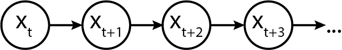

### Initializing a Markov chain

Every Markov chain needs to be initialized.
To do so, we need an **initial state probability vector**,
which tells us what the distribution of initial states will be.
Let's call the vector $p_S$, where the subscript $S$ indicates that it is for the "states".

$$ p_{init} =
\begin{pmatrix} p_1 & p_2 & p_3
\end{pmatrix}
$$

Semantically, they allocate the probabilities of starting the sequence at a given state.
For example, we might assume a discrete uniform distribution, which in Python would look like:

```python
import numpy as np
p_init = np.array([1/3., 1/3., 1/3.])
```

Alternatively, we might assume a fixed starting point, which can be expressed as the $p_S$ array:

```python
p_init = np.array([0, 1, 0])
```

Alternatively, we might assign non-zero probabilities to each in a non-uniform fashion:

```python
# State 0: 0.1 probability
# State 1: 0.8 probability
# State 2: 0.1 probability
p_init = np.array([0.1, 0.8, 0.1])
```

Finally, we might assume that the system was long-running before we started observing the sequence of states,
and as such the initial state was drawn as one realization of some equilibrated distribution of states.
Keep this idea in your head, as we'll need it later.

For now, just to keep things concrete,
let's specify an initial distribution as a non-uniform probability vector.


```python
import numpy as np
p_init = np.array([0.1, 0.8, 0.1])
```

### Modelling transitions between states

To know how a system transitions between states, we now need a **transition matrix**.
The transition matrix describes the probability of transitioning from one state to another.
(The probability of staying in the same state is semantically equivalent to transitioning to the same state.)

By convention, transition matrix rows correspond to the state at time $t$,
while columns correspond to state at time $t+1$.
Hence, row probabilities sum to one,
because the probability of transitioning to the next state depends on only the current state,
and all possible states are known and enumerated.

Let's call the transition matrix $P_{transition}$.
The symbol etymology, which usually gets swept under the rug in mathematically-oriented papers, are as follows:

- $transition$ doesn't refer to time but simply indicates that it is for transitioning states,
- $P$ is used because it is a probability matrix.

$$ P_{transition} =
\begin{pmatrix}
    p_{11} & p_{12} & p_{13}\\
    p_{21} & p_{22} & p_{23}\\
    p_{31} & p_{32} & p_{33}\\
\end{pmatrix}
$$

Using the transition matrix, we can express that the system likes to stay in the state that it enters into,
by assigning larger probability mass to the diagonals.
Alternatively, we can express that the system likes to transition out of states that it enters into,
by assigning larger probability mass to the off-diagonal.

Alrighty, enough with that now, let's initialize a transition matrix below.


```python
p_transition = np.array(
    [[0.90, 0.05, 0.05],
     [0.01, 0.90, 0.09],
     [0.07, 0.03, 0.9]]
)
p_transition
```


    array([[0.9 , 0.05, 0.05],
           [0.01, 0.9 , 0.09],
           [0.07, 0.03, 0.9 ]])


And just to confirm with you that each row sums to one:


```python
assert p_transition[0, :].sum() == 1
assert p_transition[1, :].sum() == 1
assert p_transition[2, :].sum() == 1
```

### Equilibrium or Stationary Distribution

Now, do you remember how above we talked about
the Markov chain being in some "equilibrated" state?
Well, the stationary or equilibrium distribution of a Markov chain
is the distribution of observed states at infinite time.

An interesting property is that regardless of what the initial state is,
the equilibrium distribution will always be the same,
as the equilibrium distribution only depends on the transition matrix.

Here's how to think about the equilibrium:
if you were to imagine instantiating a thousand Markov chains
using the initial distribution

$$ p_{init} =
\begin{pmatrix} 0.1 & 0.8 & 0.1
\end{pmatrix}
$$

- 10% would start out in state 1
- 80% would start out in state 2
- 10% would start out in state 3

However, if you ran each of the systems to a large number of time steps
(say, 1 million time steps, to exaggerate the point)
then how the states were distributed initially wouldn't matter,
as how they transition from time step to time step
begins to dominate.

We could simulate this explicitly in Python,
but as it turns out, there is a mathematical shortcut
that involves simple dot products.
Let's check it out.

Assume we have an initial state and a transition matrix.
We're going to reuse `p_init` from above, but use a different `p_transition`
to make the equilibrium distribution values distinct.
This will make it easier for us to plot later.


```python
p_transition_example = np.array(
    [[0.6,  0.2, 0.2],
     [0.05, 0.9, 0.05],
     [0.1,  0.2, 0.7]]
)
```

To simulate the distribution of states in the next time step,
we take the initial distribution `p_init`
and matrix multiply it against the transition matrix.


```python
p_next = p_init @ p_transition_example
p_next
```


    array([0.11, 0.76, 0.13])


We can do it again to simulate the distribution of states in the _next_ time step after:


```python
p_next = p_next @ p_transition_example
p_next
```


    array([0.117, 0.732, 0.151])


Let's now write a for-loop to automate the process.


```python
p_state_t = [p_init]

for i in range(200):  # 200 time steps sorta, kinda, approximates infinite time :)
    p_state_t.append(p_state_t[-1] @ p_transition_example)
```

To make it easier for you to see what we've generated, let's make the `p_state_t` list into a pandas DataFrame.


```python
import pandas as pd

state_distributions = pd.DataFrame(p_state_t)
state_distributions
```


<div>
<style scoped>
    .dataframe tbody tr th:only-of-type {
        vertical-align: middle;
    }

    .dataframe tbody tr th {
        vertical-align: top;
    }

    .dataframe thead th {
        text-align: right;
    }
</style>
<table border="1" class="dataframe">
  <thead>
    <tr style="text-align: right;">
      <th></th>
      <th>0</th>
      <th>1</th>
      <th>2</th>
    </tr>
  </thead>
  <tbody>
    <tr>
      <th>0</th>
      <td>0.100000</td>
      <td>0.800000</td>
      <td>0.10000</td>
    </tr>
    <tr>
      <th>1</th>
      <td>0.110000</td>
      <td>0.760000</td>
      <td>0.13000</td>
    </tr>
    <tr>
      <th>2</th>
      <td>0.117000</td>
      <td>0.732000</td>
      <td>0.15100</td>
    </tr>
    <tr>
      <th>3</th>
      <td>0.121900</td>
      <td>0.712400</td>
      <td>0.16570</td>
    </tr>
    <tr>
      <th>4</th>
      <td>0.125330</td>
      <td>0.698680</td>
      <td>0.17599</td>
    </tr>
    <tr>
      <th>...</th>
      <td>...</td>
      <td>...</td>
      <td>...</td>
    </tr>
    <tr>
      <th>196</th>
      <td>0.133333</td>
      <td>0.666667</td>
      <td>0.20000</td>
    </tr>
    <tr>
      <th>197</th>
      <td>0.133333</td>
      <td>0.666667</td>
      <td>0.20000</td>
    </tr>
    <tr>
      <th>198</th>
      <td>0.133333</td>
      <td>0.666667</td>
      <td>0.20000</td>
    </tr>
    <tr>
      <th>199</th>
      <td>0.133333</td>
      <td>0.666667</td>
      <td>0.20000</td>
    </tr>
    <tr>
      <th>200</th>
      <td>0.133333</td>
      <td>0.666667</td>
      <td>0.20000</td>
    </tr>
  </tbody>
</table>
<p>201 rows × 3 columns</p>
</div>


Now, let's plot what the distributions look like.


```python
import matplotlib.pyplot as plt
state_distributions.plot();
```


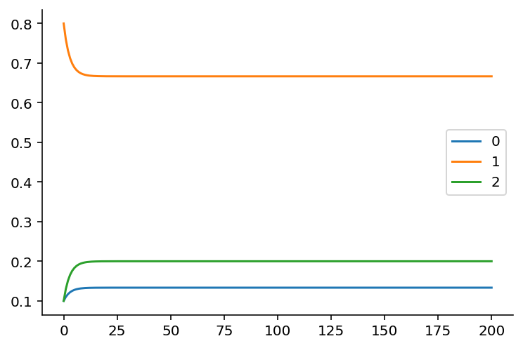


If you're viewing this notebook on [Binder](https://mybinder.org/v2/gh/ericmjl/bayesian-analysis-recipes/master) or locally, go ahead and modify the initial state to convince yourself that it doesn't matter what the initial state will be: the equilibrium state distribution, which is the fraction of time the Markov chain is in that state over infinite time, will always be the same as long as the transition matrix stays the same.


```python
print(p_state_t[-1])
```

    [0.13333333 0.66666667 0.2       ]


As it turns out, there's also a way to solve for the equilibrium distribution analytically from the transition matrix. This involves solving a linear algebra problem, which we can do using Python. (Credit goes to [this blog post](https://towardsdatascience.com/markov-chain-analysis-and-simulation-using-python-4507cee0b06e) from which I modified the code to fit the variable naming here.)


```python
def equilibrium_distribution(p_transition):
    n_states = p_transition.shape[0]
    A = np.append(
        arr=p_transition.T - np.eye(n_states),
        values=np.ones(n_states).reshape(1, -1),
        axis=0
    )
    b = np.transpose(np.array([0] * n_states + [1]))
    p_eq = np.linalg.solve(
        a=np.transpose(A).dot(A),
        b=np.transpose(A).dot(b)
    )
    return p_eq

# alternative
def equilibrium_distribution(p_transition):
    """This implementation comes from Colin Carroll, who kindly reviewed the notebook"""
    n_states = p_transition.shape[0]
    A = np.append(
        arr=p_transition.T - np.eye(n_states),
        values=np.ones(n_states).reshape(1, -1),
        axis=0
    )
    # Moore-Penrose pseudoinverse = (A^TA)^{-1}A^T
    pinv = np.linalg.pinv(A)
    # Return last row
    return pinv.T[-1]


print(equilibrium_distribution(p_transition_example))
```

    [0.13333333 0.66666667 0.2       ]


### Generating a Markov Sequence

Generating a Markov sequence means we "forward" simulate the chain by:

(1) Optionally drawing an initial state from $p_S$ (let's call that $s_{t}$). This is done by drawing from a **multinomial** distribution:

$$s_t \sim Multinomial(1, p_S)$$

If we assume (and keep in mind that we don't have to) that the system was equilibrated before we started observing its state sequence,
then the initial state distribution is equivalent to the equilibrium distribution.
All this means that we don't necessarily have to specify the initial distribution explicitly.

(2) Drawing the next state by indexing into the transition matrix $p_T$, and drawing a new state based on the Multinomial distribution:

$$s_{t+1} \sim Multinomial(1, p_{T_i})$$

where $i$ is the index of the state.

I previously wrote about [what probability distributions are](https://ericmjl.github.io/essays-on-data-science/machine-learning/computational-bayesian-stats/),
leveraging the SciPy probability distributions library.
We're going to use that extensively here,
as opposed to NumPy's `random` module,
so that we can practice getting familiar
with probability distributions as objects.
In Python code:


```python
from scipy.stats import multinomial
from typing import List

def markov_sequence(p_init: np.array, p_transition: np.array, sequence_length: int) -> List[int]:
    """
    Generate a Markov sequence based on p_init and p_transition.
    """
    if p_init is None:
        p_init = equilibrium_distribution(p_transition)
    initial_state = list(multinomial.rvs(1, p_init)).index(1)

    states = [initial_state]
    for _ in range(sequence_length - 1):
        p_tr = p_transition[states[-1]]
        new_state = list(multinomial.rvs(1, p_tr)).index(1)
        states.append(new_state)
    return states
```

With this function in hand, let's generate a sequence of length 1000.


```python
import seaborn as sns

states = markov_sequence(p_init, p_transition, sequence_length=1000)
fig, ax = plt.subplots(figsize=(12, 4))
plt.plot(states)
plt.xlabel("time step")
plt.ylabel("state")
plt.yticks([0, 1, 2])
sns.despine()
```


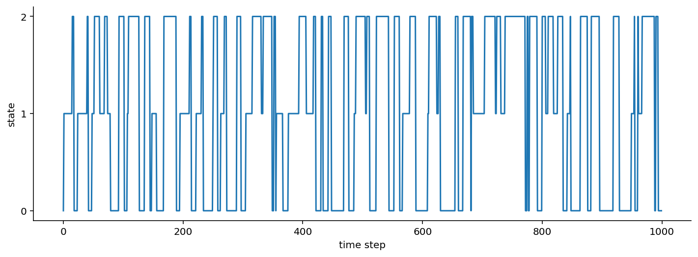


As is pretty evident from the transition probabilities, once this Markov chain enters a state, it tends to maintain its current state rather than transitioning between states.

If you've opened up this notebook in [Binder](https://mybinder.org/v2/gh/ericmjl/bayesian-analysis-recipes/master) or locally, feel free to modify the transition probabilities and initial state probabilities above to see how the Markov sequence changes.

If a "Markov sequence" feels abstract at this point, one example to help you anchor your understanding would be human motion. The three states can be "stationary", "walking", and "running". We transition between the three states with some probability throughout the day, moving from "stationary" (sitting at my desk) to "walking" (to get water) to "stationary" (because I'm pouring water), to "walking" (out the door) to finally "running" (for exercise).

## Emissions: When Markov chains not only produce "states", but also observable data

So as you've seen above, a Markov chain can produce "states". If we are given direct access to the "states", then a problem that we may have is inferring the transition probabilities given the states.

A more common scenario, however, is that the states are **latent**, i.e. we cannot directly observe them. Instead, the latent states generate data that are given by some distribution conditioned on the state. We call these **Hidden Markov Models**.

That all sounds abstract, so let's try to make it more concrete.

### Gaussian Emissions: When Markov chains emit Gaussian-distributed data.

With a three state model, we might say that the emissions are Gaussian distributed, but the location ($\mu$) and scale ($\sigma$) vary based on which state we are in. In the simplest case:

1. State 1 gives us data $y_1 \sim N(\mu=1, \sigma=0.2)$
1. State 2 gives us data $y_2 \sim N(\mu=0, \sigma=0.5)$
1. State 3 gives us data $y_3 \sim N(\mu=-1, \sigma=0.1)$

In terms of a graphical model, it would look something like this:

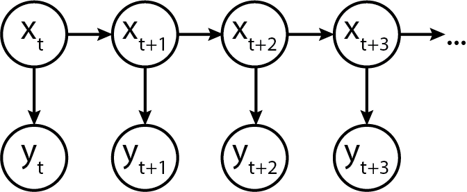

Turns out, we can model this in Python code too!


```python
from scipy.stats import norm

def gaussian_emissions(states: List[int], mus: List[float], sigmas: List[float]) -> List[float]:
    emissions = []
    for state in states:
        loc = mus[state]
        scale = sigmas[state]
        e = norm.rvs(loc=loc, scale=scale)
        emissions.append(e)
    return emissions
```

Let's see what the emissions look like.


```python
gaussian_ems = gaussian_emissions(states, mus=[1, 0, -1], sigmas=[0.2, 0.5, 0.1])

def plot_emissions(states, emissions):
    fig, axes = plt.subplots(figsize=(16, 8), nrows=2, ncols=1, sharex=True)

    axes[0].plot(states)
    axes[0].set_title("States")
    axes[1].plot(emissions)
    axes[1].set_title("Emissions")
    sns.despine();

plot_emissions(states, gaussian_ems)
```


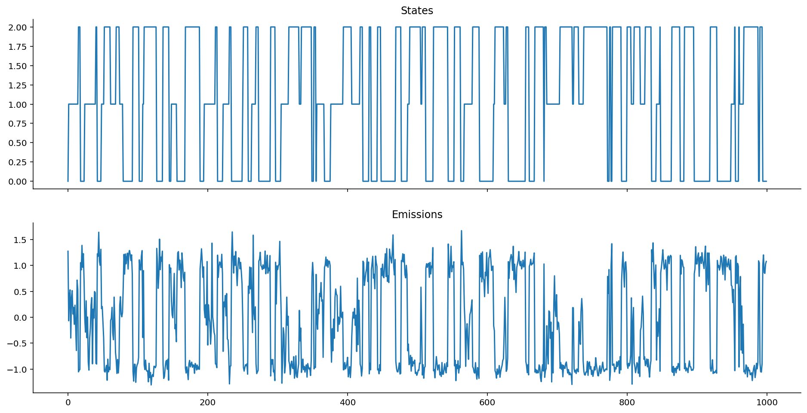


### Emission Distributions can be any valid distribution!

Nobody said we have to use Gaussian distributions for emissions; we can, in fact, have a ton of fun and start simulating data using other distributions!

Let's try Poisson emissions. Here, then, the poisson rate $\lambda$ is given one per state. In our example below:

1. State 1 gives us data $y_1 \sim Pois(\lambda=1)$
1. State 2 gives us data $y_2 \sim Pois(\lambda=10)$
1. State 3 gives us data $y_3 \sim Pois(\lambda=50)$


```python
from scipy.stats import poisson
def poisson_emissions(states: List[int], lam: List[float]) -> List[int]:
    emissions = []
    for state in states:
        rate = lam[state]
        e = poisson.rvs(rate)
        emissions.append(e)
    return emissions
```

Once again, let's observe the emissions:


```python
poisson_ems = poisson_emissions(states, lam=[1, 10, 50])
plot_emissions(states, poisson_ems)
```


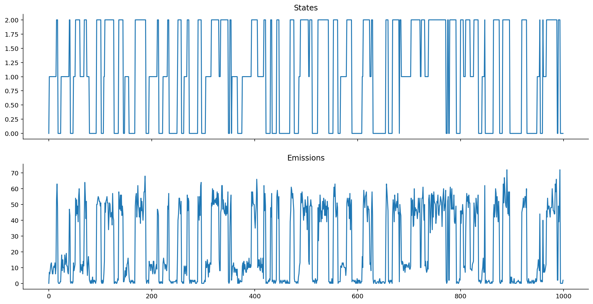


Hope the point is made:
Take your favourite distribution
and use it as the emission distribution,
as long as it can serve as a useful model
for the data that you observe!

### Autoregressive Emissions

Autoregressive emissions make things even more interesting and flexible!
They show up, for example,
when we're trying to model "motion states" of people or animals:
that's because people and animals don't _abruptly_
change from one state to another,
but gradually transition in.

The "autoregressive" component thus helps us model that
the emission value does not only depend on the current state, but also on previous state(s),
which is what motion data, for example, might look like.

How, though, can we enforce this dependency structure? Well, as implied by the term "structure", it means we have some set of equations that relate the parameters of the emission distribution to the value of the previous emission.

In terms of a generic graphical model, it is represented as follows:


### Heteroskedastic Autoregressive Emissions

Here's a "simple complex" example, where the location $\mu_t$ of the emission distribution at time $t$ depends on $y_{t-1}$, and the scale $\sigma$ depends only on the current state $s_t$.

A place where this model might be useful is when we believe that
noise is the only thing that depends on state,
while the location follows a random walk.
(Stock markets might be an applicable place for this.)

In probabilistic notation:

$$y_t \sim N(\mu=k y_{t-1}, \sigma=\sigma_{s_t})$$

Here, $k$ is a multiplicative autoregressive coefficient that scales how the previous emission affects the location $\mu$ of the current emission. We might also assume that the initial location $\mu=0$. Because the scale $\sigma$ varies with state, the emissions are called **heteroskedastic**, which means "of non-constant variance". In the example below:

1. State 1 gives us $\sigma=0.5$ (kind of small variance).
1. State 2 gives us $\sigma=0.1$ (smaller variance).
1. State 3 gives us $\sigma=0.01$ (very small varaince).

In Python code, we would model it this way:


```python
def ar_gaussian_heteroskedastic_emissions(states: List[int], k: float, sigmas: List[float]) -> List[float]:
    emissions = []
    prev_loc = 0
    for state in states:
        e = norm.rvs(loc=k * prev_loc, scale=sigmas[state])
        emissions.append(e)
        prev_loc = e
    return emissions
```


```python
ar_het_ems = ar_gaussian_heteroskedastic_emissions(states, k=1, sigmas=[0.5, 0.1, 0.01])
plot_emissions(states, ar_het_ems)
```


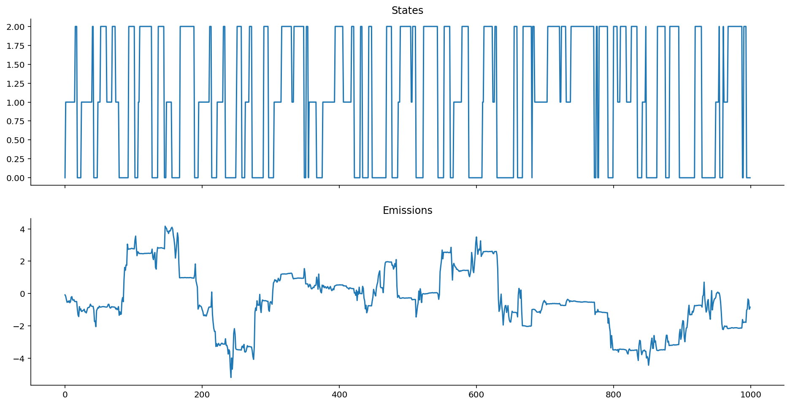


Keep in mind, here, that given the way that we've defined the **autoregressive heteroskedastic Gaussian HMM**, it is the **variance** around the _heteroskedastic autoregressive emissions_ that gives us information about the state, _not_ the location. (To see this, notice how every time the system enters into state 2, the chain stops bouncing around much.)

Contrast that against vanilla Gaussian emissions that are non-autoregressive:


```python
plot_emissions(states, gaussian_ems)
```


### How does the autoregressive coefficient $k$ affect the Markov chain emissions?

As should be visible, the **structure** of autoregressiveness can really change how things look! What happens as $k$ changes?


```python
ar_het_ems = ar_gaussian_heteroskedastic_emissions(states, k=1, sigmas=[0.5, 0.1, 0.01])
plot_emissions(states, ar_het_ems)
```


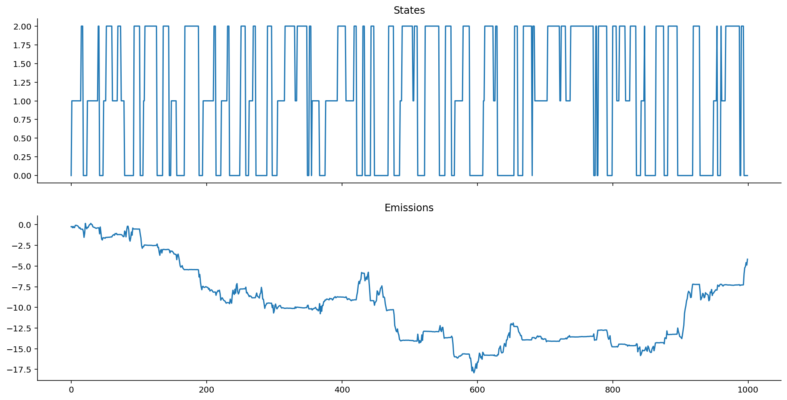


```python
ar_het_ems = ar_gaussian_heteroskedastic_emissions(states, k=0, sigmas=[0.5, 0.1, 0.01])
plot_emissions(states, ar_het_ems)
```


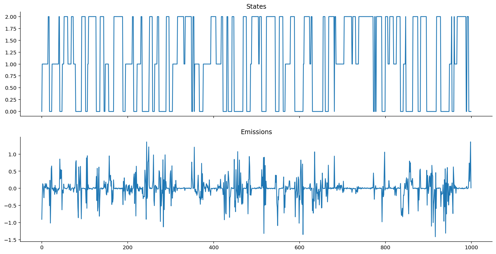


Interesting stuff! As $k \rightarrow 0$, we approach a Gaussian centered exactly on zero, where only the variance of the observations, rather than the collective average location of the observations, give us information about the state.

### Homoskedastic Autoregressive Emissions

What if we wanted instead the variance to remain the same, but desired instead that the emission location $\mu$ gives us information about the state while still being autoregressive? Well, we can bake that into the equation structure!

$$y_t \sim N(\mu=k y_{t-1} + \mu_{s_t}, \sigma=1)$$

In Python code:


```python
def ar_gaussian_homoskedastic_emissions(states: List[int], k: float, mus: List[float]) -> List[float]:
    emissions = []
    prev_loc = 0
    for state in states:
        e = norm.rvs(loc=k * prev_loc + mus[state], scale=1)
        emissions.append(e)
        prev_loc = e
    return emissions
```


```python
ar_hom_ems = ar_gaussian_homoskedastic_emissions(states, k=1, mus=[-10, 0, 10])
plot_emissions(states, ar_hom_ems)
```


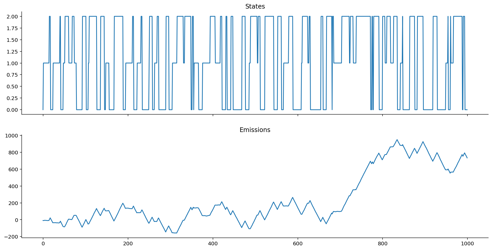


The variance is too small relative to the scale of the data, so it looks like smooth lines.

If we change $k$, however, we get interesting effects.


```python
ar_hom_ems = ar_gaussian_homoskedastic_emissions(states, k=0.8, mus=[-10, 0, 10])
plot_emissions(states, ar_hom_ems)
```


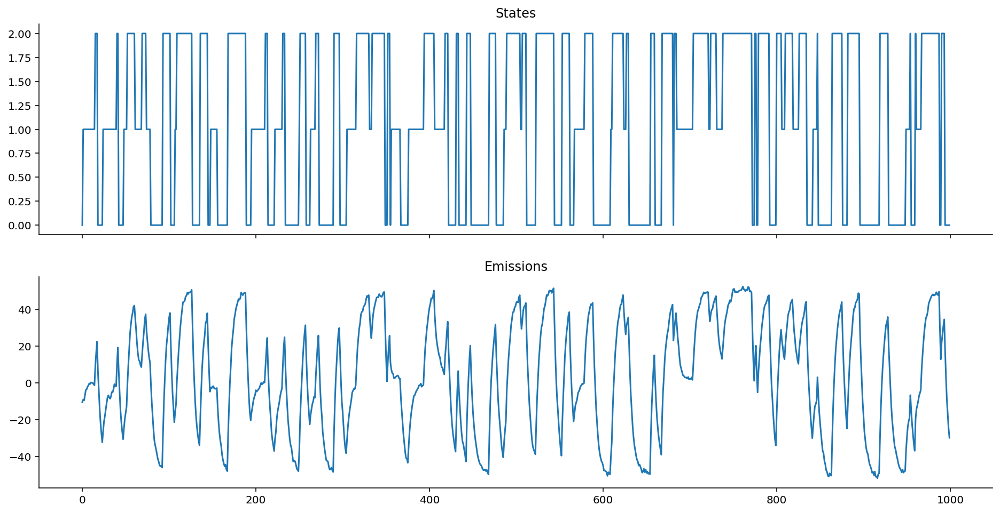


Notice how we get "smoother" transitions into each state. It's less jumpy. As mentioned earlier, this is extremely useful for modelling motion activity, for example, where people move into and out of states without having jumpy-switching. (We don't go from sitting to standing to walking by jumping frames, we ease into each.)

### Non-Autoregressive Homoskedastic Emissions

With non-autoregressive homoskedastic Gaussian emissions, the mean $\mu$ depends only on the hidden state at time $t$, and not on the previous hidden state or the previous emission value.

In equations: $y_t \sim N(\mu=f(x_t), \sigma)$, where $f(x_t)$ could be a simple mapping:

1. If $x_t = 1$, $\mu = -10$,
1. If $x_t = 2$, $\mu = 0$,
1. If $x_t = 3$, $\mu = 10$.

What we can see here is that the mean gives us information about the state, but the scale doesn't.


```python
def gaussian_homoskedastic_emissions(states: List[int], mus: List[float]) -> List[float]:
    emissions = []

    prev_loc = 0
    for state in states:
        e = norm.rvs(loc=mus[state], scale=1)
        emissions.append(e)
        prev_loc = e
    return emissions
```


```python
hom_ems = gaussian_homoskedastic_emissions(states, mus=[-10, 0, 10])
plot_emissions(states, hom_ems)
```


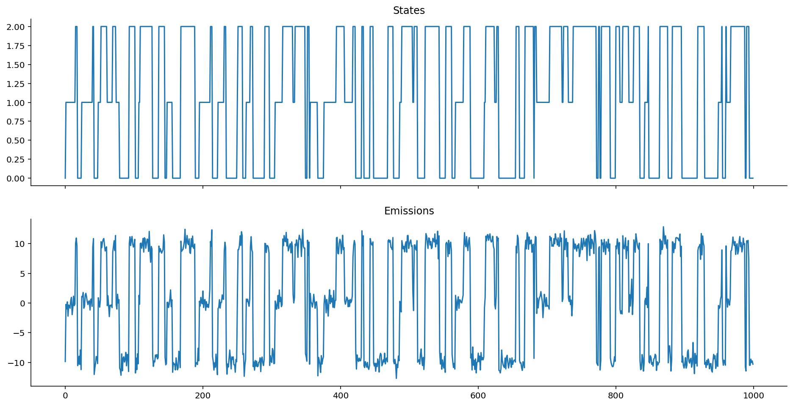


As you might intuit from looking at the equations, this is nothing more than a special case of the Heteroskedastic Gaussian Emissions example shown much earlier above.

## The Framework

There's the plain old **Markov Model**, in which we might generate a sequence of states $S$, which are generated from some initial distribution and transition matrix.

$$ p_S =
\begin{pmatrix} p_1 & p_2 & p_3
\end{pmatrix}
$$

$$ p_T =
\begin{pmatrix}
    p_{11} & p_{12} & p_{13}\\
    p_{21} & p_{22} & p_{23}\\
    p_{31} & p_{32} & p_{33}\\
\end{pmatrix}
$$

$$S = \{s_t, s_{t+1}, ... s_{t+n}\}$$

Graphically:


Then there's the **"Hidden" Markov Model**,
in which we don't observe the states
but rather the _emissions_ generated from the states
(according to some assumed distribution).
Now, there's not only the initial distribution
and transition matrix to worry about,
but also the distribution of the emissions
conditioned on the state.
The general case is when we have some distribution
e.g., the Gaussian or the Poisson or the Chi-Squared -
whichever fits the likelihood of your data best.
Usually, we would pick a parametric distribution
both because of modelling convenience
and because we think it would help us interpret our data.

$$y_t|s_t \sim Dist(\theta_{t})$$

Where $\theta_t$ refers to the parameters for the generic distribution $Dist$ that are indexed by the state $s_t$. (Think back to "state 1 gives me $N(-10, 1)$, while state 2 gives me $N(0, 1)$", etc...) Your distributions probably generally come from the same family (e.g. "Gaussians"), or you can go super complicated and generate them from different distributions.

Graphically:


Here are some special cases of the general framework. Firstly, the parameters of the _emission distribution_ can be held constant (i.e. simple random walks). This is equivalent to when $k=1$ and neither $\mu$ nor $\sigma$ depend on current state. In this case, we get back the Gaussian random walk, where $y_t \sim N(k y_{t-1}, \sigma)$!

Secondly, the distribution parameters can depend on the solely on the current state. In this case, you get back basic HMMs!

If you make the variance of the likelihood distribution vary based on state, you get **heteroskedastic** HMMs; conversely, if you keep the variance constant, then you have **homoskedastic** HMMs.

Moving on, there's the **"Autoregressive" Hidden Markov Models**, in which the emissions generated from the states have a dependence on the previous states' emissions (and hence, indirectly, on the previous state). Here, we have the ultimate amount of flexibility to model our processes.

$$y_t|s_t \sim Dist(f(y_{t-1}, \theta_t))$$

Graphically:


To keep things simple in this essay, we've only considered the case of lag of 1 (which is where the $t-1$ comes from). However, arbitrary numbers of time lags are possible too!

And, as usual, you can make them homoskedastic or heteroskedastic by simply controlling the variance parameter of the $Dist$ distribution.

Bonus point: your data don't necessarily have to be single dimensional;
they can be multidimensional too!
As long as you write the $f(y_{t-1}, \theta_t)$
in a fashion that handles $y$ that are multidimensional,
you're golden!
Moreover, you can also write the function $f$ to be any function you like.
The function $f$ doesn't have to be a linear function (like we did);
it can instead be a neural network if you so choose,
thus giving you a natural progression from Markov models to Recurrent Neural Networks.
That, however, is out of scope for this essay.

## Bayesian Inference on Markov Models

Now that we've gone through the "data generating process" for Markov sequences with emissions, we can re-examine the entire class of models in a Bayesian light.

If you've been observing the models that we've been "forward-simulating" all this while to generate data, you'll notice that there are a few key parameters that seemed like, "well, if we changed them, then the data would change, right?" If that's what you've been thinking, then bingo! You're on the right track.

Moreover, you'll notice that I've couched everything in the language of probability distributions.
The transition probabilities $P(s_t | s_{t-1})$ are given by a Multinomial distribution.
The emissions are given by an arbitrary continuous (or discrete) distribution,
depending on what you believe to be the likelihood distribution for the observed data.
Given that we're working with probability distributions and data, you probably have been thinking about it already:
we need a way to calculate the log-likelihoods of the data that we observe!

(Why we use log-likelihoods instead of likelihoods
is clarified [here](https://ericmjl.github.io/essays-on-data-science/machine-learning/computational-bayesian-stats/#defining-posterior-log-likelihood).)

### Markov Chain Log-Likelihood Calculation

Let's examine how we would calculate the log likelihood of **state data** given the parameters. This will lead us to the Markov chain log-likelihood.

The likelihood of a given Markov chain states is:

1. the probability of the first state given some assumed initial distribution,
1. times the probability of the second state given the first state,
1. times the probability of the third state given the second state,
1. and so on... until the end.

In math notation, given the states $S = \{s_1, s_2, s_3, ..., s_n\}$, this becomes:

$$L(S) = P(s_1) P(s_2|s_1) P(s_3|s_2) ...$$

More explicitly, $P(s_1)$ is nothing more than the probability of observing that state $s_1$ given an assumed initial (or equilibrium) distribution:


```python
s1 = [0, 1, 0]  # assume we start in state 1 of {0, 1, 2}
p_eq = equilibrium_distribution(p_transition)
prob_s1 = p_eq[s1.index(1)]
prob_s1
```


    0.27896995708154565


Then, $P(s_2)$ is nothing more than the probability of observing that state $s_2$ given the transition matrix entry for state $s_1$.


```python
# assume we enter into state 2 of {0, 1, 2}
s2 = [0, 0, 1]
transition_entry = p_transition[s1.index(1)]
prob_s2 = transition_entry[s2.index(1)]
prob_s2
```


    0.09


Their joint likelihood is given then by `prob_s1` times `prob_s2`.


```python
prob_s1 * prob_s2
```


    0.025107296137339107


And because we operate in log space to avoid underflow, we do joint log-likelihoods instead:


```python
np.log(prob_s1) + np.log(prob_s2)
```


    -3.6845967923219334


Let's generalize this in a math function.

Since $P(s_t|s_{t-1})$ is a **multinomial distribution**, then if we are given the log-likelihood of $\{s_1, s_2, s_3, ..., s_n\}$, we can calculate the log-likelihood over $\{s_2,... s_n\}$, which is given by the sum of the log probabilities:


```python
def state_logp(states, p_transition):
    logp = 0

    # states are 0, 1, 2, but we model them as [1, 0, 0], [0, 1, 0], [0, 0, 1]
    states_oh = np.eye(len(p_transition))
    for curr_state, next_state in zip(states[:-1], states[1:]):
        p_tr = p_transition[curr_state]
        logp += multinomial(n=1, p=p_tr).logpmf(states_oh[next_state])
    return logp

state_logp(states, p_transition)
```


    -418.65677519562405


We will also write a vectorized version of `state_logp`.


```python
def state_logp_vect(states, p_transition):
    states_oh = np.eye(len(p_transition))
    p_tr = p_transition[states[:-1]]
    obs = states_oh[states[1:]]
    return np.sum(multinomial(n=1, p=p_tr).logpmf(obs))

state_logp_vect(states, p_transition)
```


    -418.6567751956279


Now, there is a problem here: we also need the log likelihood of the first state.

Remember that if we don't know what the initial distribution is supposed to be,
one possible assumption we can make is that the Markov sequence began by drawing from the equilibrium distribution.
Here is where equilibrium distribution calculation from before comes in handy!


```python
def initial_logp(states, p_transition):
    initial_state = states[0]
    states_oh = np.eye(len(p_transition))
    eq_p = equilibrium_distribution(p_transition)
    return (
        multinomial(n=1, p=eq_p)
        .logpmf(states_oh[initial_state].squeeze())
    )

initial_logp(states, p_transition)
```


    array(-1.16057901)


Taken together, we get the following Markov chain log-likelihood:


```python
def markov_state_logp(states, p_transition):
    return (
        state_logp_vect(states, p_transition)
        + initial_logp(states, p_transition)
    )

markov_state_logp(states, p_transition)
```


    -419.81735420804523


### Markov Chain with Gaussian Emissions Log-Likelihood Calculation

Now that we know how to calculate the log-likelihood for the Markov chain sequence of states,
we can move on to the log-likelihood calculation for the emissions.

Let's first assume that we have emissions that are non-autoregressive, and have a Gaussian likelihood.
For the benefit of those who need it written out explicitly,
here's the for-loop version:


```python
def gaussian_logp(states, mus, sigmas, emissions):
    logp = 0
    for (emission, state) in zip(emissions, states):
        logp += norm(mus[state], sigmas[state]).logpdf(emission)
    return logp

gaussian_logp(states, mus=[1, 0, -1], sigmas=[0.2, 0.5, 0.1], emissions=gaussian_ems)
```


    250.57996114495296


And we'll also make a vectorized version of it:


```python
def gaussian_logp_vect(states, mus, sigmas, emissions):
    mu = mus[states]
    sigma = sigmas[states]
    return np.sum(norm(mu, sigma).logpdf(emissions))

gaussian_logp_vect(states, mus=np.array([1, 0, -1]), sigmas=np.array([0.2, 0.5, 0.1]), emissions=gaussian_ems)
```


    250.5799611449528


The joint log likelihood of the emissions and states are then given by their summation.


```python
def gaussian_emission_hmm_logp(states, p_transition, mus, sigmas, emissions):
    return markov_state_logp(states, p_transition) + gaussian_logp_vect(states, mus, sigmas, emissions)

gaussian_emission_hmm_logp(states, p_transition, mus=np.array([1, 0, -1]), sigmas=np.array([0.2, 0.5, 0.1]), emissions=gaussian_ems)
```


    -169.23739306309244


If you're in a [Binder](https://mybinder.org/v2/gh/ericmjl/bayesian-analysis-recipes/master) or local Jupyter session, go ahead and tweak the values of `mus` and `sigmas`, and verify for yourself that the current values are the "maximum likelihood" values. After all, our Gaussian emission data were generated according to this exact set of parameters!

### Markov Chain with Autoregressive Gaussian Emissions Log-Likelihood Calculation

I hope the pattern is starting to be clear here: since we have Gaussian emissions, we only have to calculate the parameters of the Gaussian to know what the logpdf would be.

As an example, I will be using the Gaussian with:

- State-varying scale
- Mean that is dependent on the previously emitted value

This is the AR-HMM with data generated from the `ar_gaussian_heteroskedastic_emissions` function.


```python
def ar_gaussian_heteroskedastic_emissions_logp(states, k, sigmas, emissions):
    logp = 0
    initial_state = states[0]
    initial_emission_logp = norm(0, sigmas[initial_state]).logpdf(emissions[0])
    for previous_emission, current_emission, state in zip(emissions[:-1], emissions[1:], states[1:]):
        loc = k * previous_emission
        scale = sigmas[state]
        logp += norm(loc, scale).logpdf(current_emission)
    return logp

ar_gaussian_heteroskedastic_emissions_logp(states, k=1.0, sigmas=[0.5, 0.1, 0.01], emissions=ar_het_ems)
```


    -18605.714303907385


Now, we can write the full log likelihood of the entire AR-HMM:


```python
def ar_gausian_heteroskedastic_hmm_logp(states, p_transition, k, sigmas, emissions):
    return (
        markov_state_logp(states, p_transition)
        + ar_gaussian_heteroskedastic_emissions_logp(states, k, sigmas, emissions)
    )


ar_gausian_heteroskedastic_hmm_logp(states, p_transition, k=1.0, sigmas=[0.5, 0.1, 0.01], emissions=ar_het_ems)
```


    -19025.53165811543


For those of you who are familiar with Bayesian inference, as soon as we have a joint log likelihood that we can calculate between our model priors and data, using the simple Bayes' rule equation, we can obtain posterior distributions easily through an MCMC sampler.

If this looks all foreign to you, then check out my [other essay](https://ericmjl.github.io/essays-on-data-science/machine-learning/computational-bayesian-stats/) for a first look (or a refresher)!

## HMM Distributions in PyMC3

While PyMC4 is in development, PyMC3 remains one of the leading probabilistic programming languages that can be used for Bayesian inference. PyMC3 doesn't have the HMM distribution defined in the library, but thanks to GitHub user **@hstrey** [posting a Jupyter notebook with HMMs defined in there](https://github.com/hstrey/Hidden-Markov-Models-pymc3/blob/master/Multi-State%20HMM.ipynb), many PyMC3 users have had a great baseline distribution to study pedagogically and use in their applications, myself included.

_Side note: I used @hstrey's implementation before setting out to write this essay. Thanks!_

The key thing to notice in this section is **how the `logp` functions are defined**. They will match the log probability functions that we have defined above, except written in Theano.

### HMM States Distribution

Let's first look at the HMM States distribution, which will give us a way to calculate the log probability of the states.


```python
import pymc3 as pm
import theano.tensor as tt
import theano.tensor.slinalg as sla  # theano-wrapped scipy linear algebra
import theano.tensor.nlinalg as nla  # theano-wrapped numpy linear algebra
import theano

theano.config.gcc.cxxflags = "-Wno-c++11-narrowing"

class HMMStates(pm.Categorical):
    def __init__(self, p_transition, p_equilibrium, n_states, *args, **kwargs):
        """You can ignore this section for the time being."""
        super(pm.Categorical, self).__init__(*args, **kwargs)
        self.p_transition = p_transition
        self.p_equilibrium = p_equilibrium
        # This is needed
        self.k = n_states
        # This is only needed because discrete distributions must define a mode.
        self.mode = tt.cast(0,dtype='int64')

    def logp(self, x):
        """Focus your attention here!"""
        p_eq = self.p_equilibrium
        # Broadcast out the transition probabilities,
        # so that we can broadcast the calculation
        # of log-likelihoods
        p_tr = self.p_transition[x[:-1]]

        # the logp of the initial state evaluated against the equilibrium probabilities
        initial_state_logp = pm.Categorical.dist(p_eq).logp(x[0])

        # the logp of the rest of the states.
        x_i = x[1:]
        ou_like = pm.Categorical.dist(p_tr).logp(x_i)
        transition_logp = tt.sum(ou_like)
        return initial_state_logp + transition_logp
```

Above, the categorical distribution is used for convenience - it can handle integers, while multinomial requires the one-hot transformation.
The categorical distribution is the generalization
of the multinomial distribution,
but unfortunately, it isn't implemented in the SciPy stats library,
which is why we used the multinomial earlier on.

Now, we stated earlier on that the transition matrix can be treated as a parameter to tweak, or else a random variable for which we want to infer its parameters. This means there is a natural fit for placing priors on them! Dirichlet distributions are great priors for probability vectors, as they are the generalization of Beta distributions.


```python
def solve_equilibrium(n_states, p_transition):
    A = tt.dmatrix('A')
    A = tt.eye(n_states) - p_transition + tt.ones(shape=(n_states, n_states))
    p_equilibrium = pm.Deterministic("p_equilibrium", sla.solve(A.T, tt.ones(shape=(n_states))))
    return p_equilibrium
```


```python
import warnings
warnings.simplefilter(action="ignore", category=FutureWarning)

n_states = 3
with pm.Model() as model:
    p_transition = pm.Dirichlet(
        "p_transition",
        a=tt.ones((n_states, n_states)) * 4,  # weakly informative prior
        shape=(n_states, n_states))

    # Solve for the equilibrium state
    p_equilibrium = solve_equilibrium(n_states, p_transition)

    obs_states = HMMStates(
        "states",
        p_transition=p_transition,
        p_equilibrium=p_equilibrium,
        n_states=n_states,
        observed=np.array(states).astype("float")
    )
```

Now let's fit the model!


```python
with model:
    trace = pm.sample(2000)
```

    Auto-assigning NUTS sampler...
    Initializing NUTS using jitter+adapt_diag...
    Multiprocess sampling (4 chains in 4 jobs)
    NUTS: [p_transition]
    Sampling 4 chains, 0 divergences:   0%|          | 0/10000 [00:00<?, ?draws/s]/home/ericmjl/anaconda/envs/bayesian-analysis-recipes/lib/python3.8/site-packages/theano/tensor/slinalg.py:255: LinAlgWarning: Ill-conditioned matrix (rcond=5.89311e-08): result may not be accurate.
      rval = scipy.linalg.solve(A, b)
    /home/ericmjl/anaconda/envs/bayesian-analysis-recipes/lib/python3.8/site-packages/theano/tensor/slinalg.py:255: LinAlgWarning: Ill-conditioned matrix (rcond=5.89311e-08): result may not be accurate.
      rval = scipy.linalg.solve(A, b)
    Sampling 4 chains, 0 divergences: 100%|██████████| 10000/10000 [00:08<00:00, 1192.11draws/s]


```python
import arviz as az

az.plot_forest(trace, var_names=["p_transition"]);
```


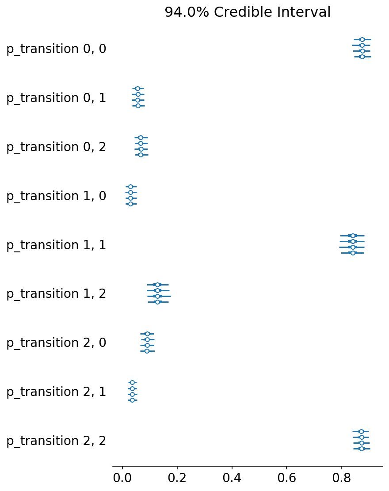


It looks like we were able to recover the original transitions!

### HMM with Gaussian Emissions

Let's try out now an HMM model with Gaussian emissions.


```python
class HMMGaussianEmissions(pm.Continuous):
    def __init__(self, states, mu, sigma, *args, **kwargs):
        super().__init__(*args, **kwargs)
        self.states = states
        # self.rate = rate
        self.mu = mu
        self.sigma = sigma

    def logp(self, x):
        """
        x: observations
        """
        states = self.states
        # rate = self.rate[states]  # broadcast the rate across the states.
        mu = self.mu[states]
        sigma = self.sigma[states]
        return tt.sum(pm.Normal.dist(mu=mu, sigma=sigma).logp(x))

```


```python
n_states = 3
with pm.Model() as model:
    # Priors for transition matrix
    p_transition = pm.Dirichlet("p_transition", a=tt.ones((n_states, n_states)), shape=(n_states, n_states))

    # Solve for the equilibrium state
    p_equilibrium = solve_equilibrium(n_states, p_transition)

    # HMM state
    hmm_states = HMMStates(
        "hmm_states",
        p_transition=p_transition,
        p_equilibrium=p_equilibrium,
        n_states=n_states,
        shape=(len(gaussian_ems),)
    )

    # Prior for mu and sigma
    mu = pm.Normal("mu", mu=0, sigma=1, shape=(n_states,))
    sigma = pm.Exponential("sigma", lam=2, shape=(n_states,))

    # Observed emission likelihood
    obs = HMMGaussianEmissions(
        "emission",
        states=hmm_states,
        mu=mu,
        sigma=sigma,
        observed=gaussian_ems
    )
```


```python
with model:
    trace = pm.sample(2000)
```

    Multiprocess sampling (4 chains in 4 jobs)
    CompoundStep
    >NUTS: [sigma, mu, p_transition]
    >CategoricalGibbsMetropolis: [hmm_states]
    Sampling 4 chains, 0 divergences: 100%|██████████| 10000/10000 [11:59<00:00, 13.90draws/s]
    The rhat statistic is larger than 1.4 for some parameters. The sampler did not converge.
    The estimated number of effective samples is smaller than 200 for some parameters.


```python
az.plot_trace(trace, var_names=["mu"]);
```


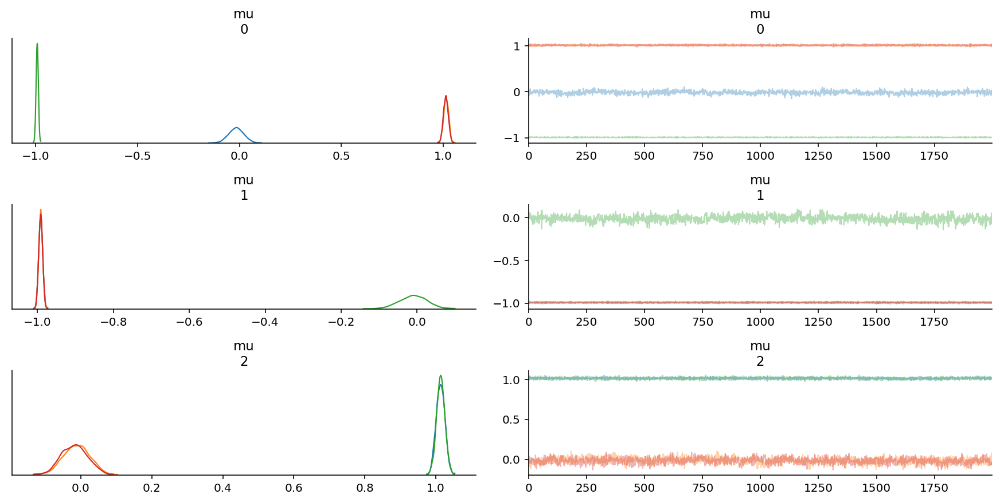


```python
az.plot_trace(trace, var_names=["sigma"]);
```


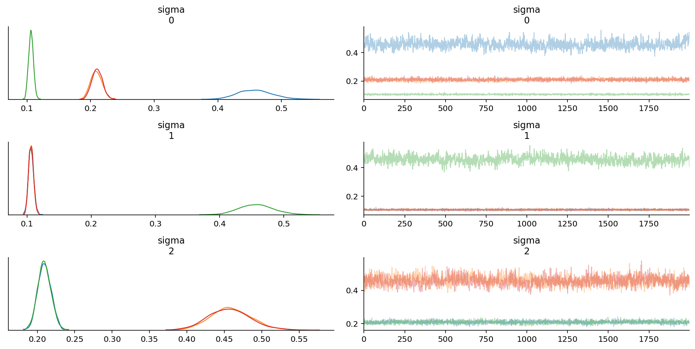


```python
az.plot_forest(trace, var_names=["sigma"]);
```


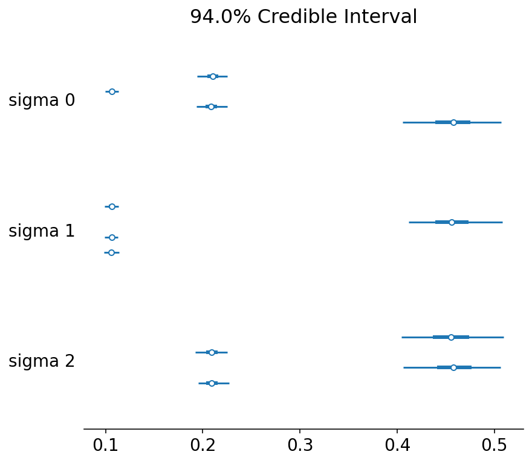


We are able to recover the parameters, but there is significant intra-chain homogeneity. That is fine, though one way to get around this is to explicitly instantiate prior distributions for each of the parameters instead.

### Autoregressive HMMs with Gaussian Emissions

Let's now add in the autoregressive component to it.
The data we will use is the `ar_het_ems` data, which were generated by using a heteroskedastic assumption, with Gaussian emissions whose mean depends on the previous value, while variance depends on state.

As a reminder of what the data look like:


```python
ar_het_ems = ar_gaussian_heteroskedastic_emissions(states, k=0.6, sigmas=[0.5, 0.1, 0.01])
plot_emissions(states, ar_het_ems)
```


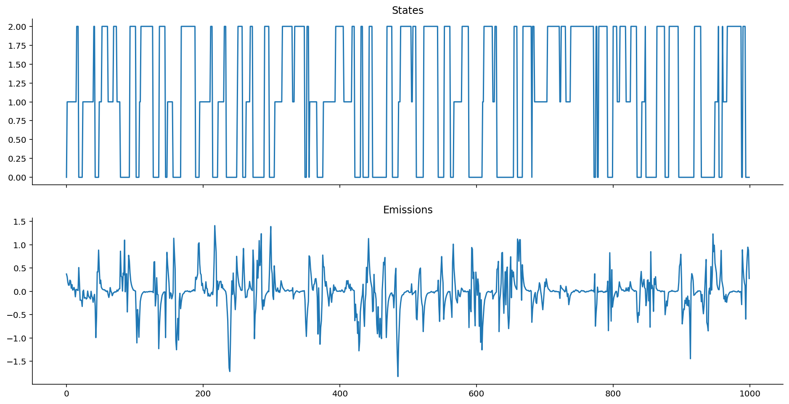


Let's now define the AR-HMM.


```python
class ARHMMGaussianEmissions(pm.Continuous):
    def __init__(self, states, k, sigma, *args, **kwargs):
        super().__init__(*args, **kwargs)
        self.states = states
        self.sigma = sigma  # variance
        self.k = k  # autoregressive coefficient.

    def logp(self, x):
        """
        x: observations
        """
        states = self.states
        sigma = self.sigma[states]
        k = self.k

        ar_mean = k * x[:-1]
        ar_like = tt.sum(pm.Normal.dist(mu=ar_mean, sigma=sigma[1:]).logp(x[1:]))

        boundary_like = pm.Normal.dist(mu=0, sigma=sigma[0]).logp(x[0])
        return ar_like + boundary_like
```


```python
n_states = 3
with pm.Model() as model:
    # Priors for transition matrix
    p_transition = pm.Dirichlet("p_transition", a=tt.ones((n_states, n_states)), shape=(n_states, n_states))

    # Solve for the equilibrium state
    p_equilibrium = solve_equilibrium(n_states, p_transition)

    # HMM state
    hmm_states = HMMStates(
        "hmm_states",
        p_transition=p_transition,
        p_equilibrium=p_equilibrium,
        n_states=n_states,
        shape=(len(ar_het_ems),)
    )

    # Prior for sigma and k
    sigma = pm.Exponential("sigma", lam=2, shape=(n_states,))
    k = pm.Beta("k", alpha=2, beta=2) # a not-so-weak prior for k

    # Observed emission likelihood
    obs = ARHMMGaussianEmissions(
        "emission",
        states=hmm_states,
        sigma=sigma,
        k=k,
        observed=ar_het_ems
    )
```


```python
with model:
    trace = pm.sample(2000)
```

    Multiprocess sampling (4 chains in 4 jobs)
    CompoundStep
    >NUTS: [k, sigma, p_transition]
    >CategoricalGibbsMetropolis: [hmm_states]
    Sampling 4 chains, 6 divergences: 100%|██████████| 10000/10000 [12:34<00:00, 13.26draws/s]
    The acceptance probability does not match the target. It is 0.9096431867898114, but should be close to 0.8. Try to increase the number of tuning steps.
    There were 6 divergences after tuning. Increase `target_accept` or reparameterize.
    The rhat statistic is larger than 1.4 for some parameters. The sampler did not converge.
    The estimated number of effective samples is smaller than 200 for some parameters.


Let's now take a look at the key parameters we might be interested in estimating:

- $k$: the autoregressive coefficient, or how much previous emissions influence current emissions.
- $\sigma$: the variance that belongs to each state.


```python
az.plot_forest(trace, var_names=["k"]);
```


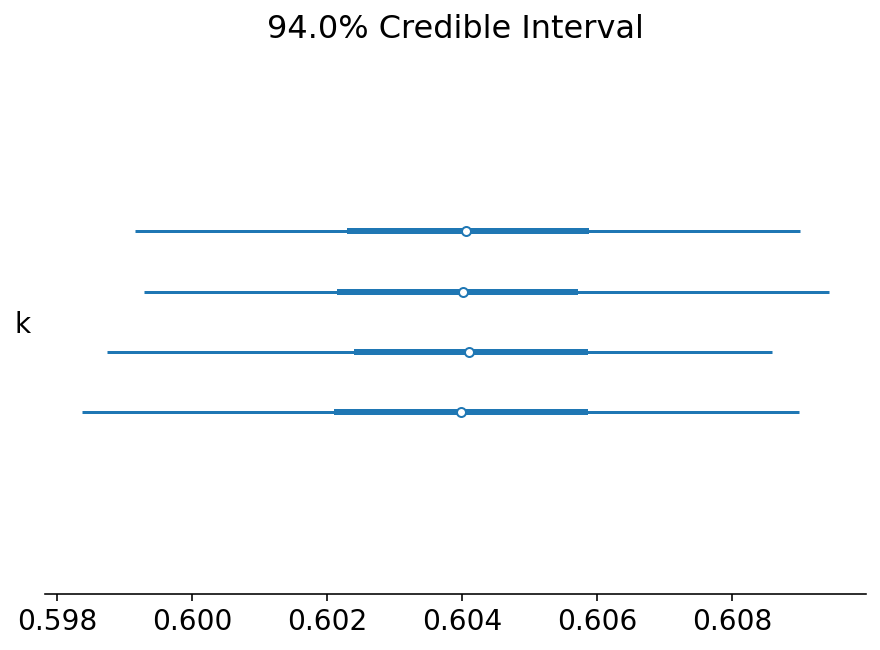


```python
az.plot_trace(trace, var_names=["k"]);
```


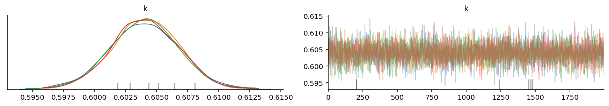


It looks like we were able to obtain the value of $k$ correctly!


```python
az.plot_trace(trace, var_names=["sigma"]);
```


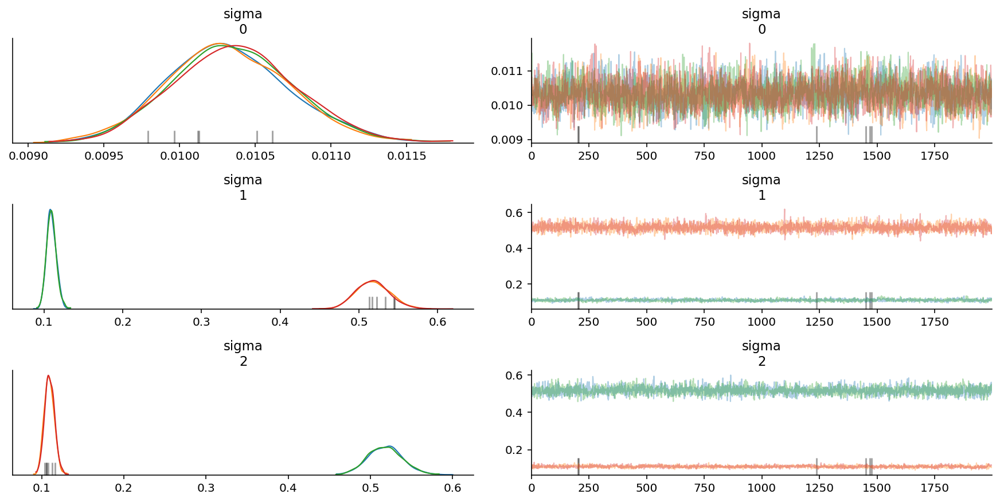


```python
az.plot_forest(trace, var_names=["sigma"]);
```


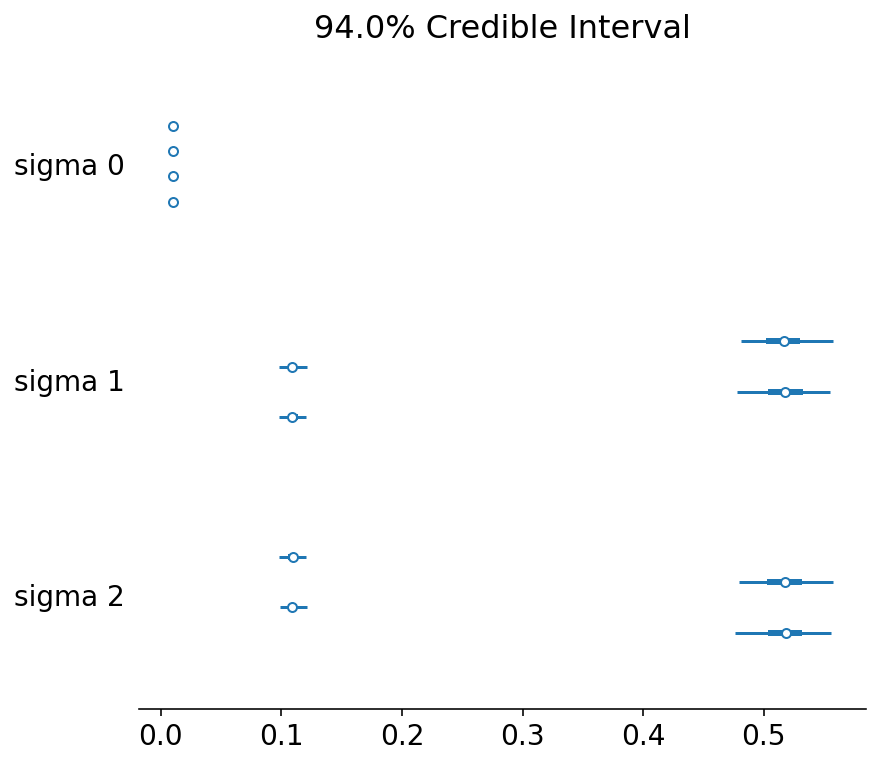


It also looks like we were able to obtain the correct sigma values too,
except that the chains are mixed up.
We would do well to take care when calculating means for each parameter on the basis of chains.

How about the chain states? Did we get them right?


```python
fig, ax = plt.subplots(figsize=(12, 4))
plt.plot(np.round(trace["hmm_states"].mean(axis=0)), label="true")
plt.plot(2 - np.array(states), label="inferred")
plt.legend();
```


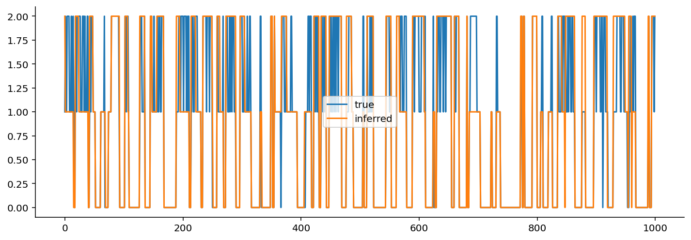


I had to flip the states because they were backwards relative to the original.

Qualitatively, not bad!
If we wanted to be a bit more rigorous,
we would quantify the accuracy of state identification.

If the transition probabilities were a bit more extreme,
we might have an easier time with the identifiability of the states.
As it stands, because the variance is the only thing that changes,
and because the variance of two of the three states are quite similar
(one is 0.1 and the other is 0.5),
distinguishing between these two states may be more difficult.

## Concluding Notes

### Nothing in statistics makes sense...

...unless in light of a "data generating model".

I initially struggled with the math behind HMMs and its variants,
because I had never taken the time to think through the "data generating process" carefully.
Once we have the data generating process, and in particular, its _structure_,
it becomes trivial to map the structure of the model to the equations that are needed to model it.
(I think this is why physicists are such good Bayesians:
they are well-trained at thinking about mechanistic, data generating models.)

For example, with autoregressive HMMs,
until I sat down and thought through the data generating process step-by-step,
nothing made sense.
Once I wrote out how the mean of the previous observation
influenced the mean of the current observation,
then things made a ton of sense.

In fact, now that I look back on my learning journey in Bayesian statistics,
if we can define a likelihood function for our data,
we can trivially work backwards and design a data generating process.

### Model structure is important

While writing out the PyMC3 implementations and conditioning them on data,
I remember times when I mismatched the model to the data,
thus generating posterior samples that exhibited pathologies: divergences and more.
This is a reminder that getting the structure of the model is very important.

### Keep learning

I hope this essay was useful for your learning journey as well.
If you enjoyed it, please take a moment to [star the repository](https://github.com/ericmjl/essays-on-data-science)!

## Acknowledgements

I would like to acknowledge the following colleagues and friends who have helped review the notebook.

- My colleagues, Zachary Barry and Balaji Goparaju, both of whom pointed out unclear phrasings in my prose and did some code review.
- Fellow PyMC developers, Colin Carroll (from whom I never cease to learn things), Alex Andorra (who also did code review), Junpeng Lao, Ravin Kumar, and Osvaldo Martin (also for their comments),
- Professor Allen Downey (of the Olin College of Engineering) who provided important pedagogical comments throughout the notebook.

## Thank you for reading!

If you enjoyed this essay and would like to receive early-bird access to more,
[please support me on Patreon][patreon]!
A coffee a month sent my way gets you _early_ access to my essays
on a private URL exclusively for my supporters
as well as shoutouts on every single essay that I put out.

[patreon]: https://patreon.com/ericmjl

Also, I have a free monthly newsletter that I use as an outlet
to share programming-oriented data science tips and tools.
If you'd like to receive it, sign up on [TinyLetter][tinyletter]!

[tinyletter]: https://tinyletter.com/ericmjl
