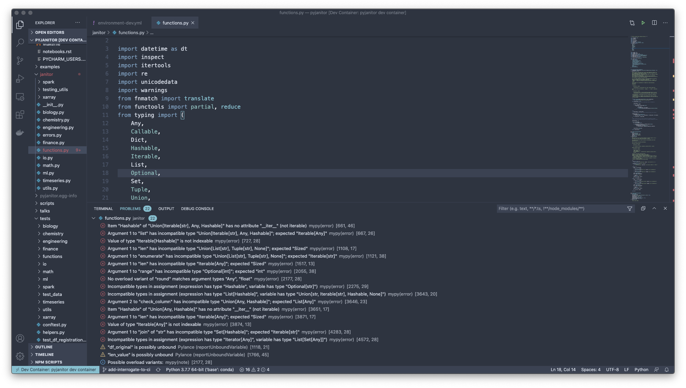

# Tools to help you write consistent Python code

As a data scientist, you might be feeling the need to level-up your code-writing skills.
After all, if your hacked together script becomes the basis of production systems, imagine the headache :).
Moreover, as time goes by, it seems to me that for data scientists to uncover the high risk,
but nonetheless potentially high value and high impact outlets,
nothing beats having software skills to flexibly express the custom logic that's needed.
Hadley Wickham's sentiment that [one can't do data science in a GUI](https://youtu.be/cpbtcsGE0OA) seems to ring true,
though I'd probably refine it by saying that one can't do _highest value_ data science without programming skills!

Mostly because of the community of [`pyjanitor`](https://github.com/ericmjl/pyjanitor) developers,
who encounter a smattering of tooling that I might not have,
I have had the privilege of learning from them a collection of tooling
that I think can really help with code style.
Especially if you transition your code from a Jupyter notebook to a `.py` source file!
Equipped with the right tools,
you can write consistent code without needing to memorize all of the rules.
And that idea of externalizing the rules to a program is what these tools are all about!

## tl;dr: What tools are there?

For the impatient, here's the summary:

### Code formatters

i.e. those that explicitly change your code:

- Black
- isort

### Code linters

i.e. those that _don’t_ change your code, but flag errors:

- Flake8
- Interrogate
- Darglint
- pylint
- mypy

Some of these come with `pre-commit hooks`, which I strongly suggest you use!

### VSCode tooling

VSCode tooling for those who are used to VSCode as your development environment:

- Python extension
- pylance: this is superbly fast. hats off, Microsoft.

### External CI services

Tools that run as an external service for your continuous integration pipeline:

- deepsource

## That’s a lot of tools; how do I interact them?

A full-fledged tutorial is probably not the realm of this tiny blog post,
but I will begin by giving you the overview of how you interact with them in general.
That should give you enough patterns to work with when you look at their docs.

### At the CLI

The code formatters and linters are runnable at the CLI.
You can consider this to be the lowest-level/primitive way of using them.
For example, with `black`, you would call on it at the command line at the root of your project repository:

```bash
black .
```

What pops out is Black telling you what files it formatted, or error messages telling you which files it couldn’t format.

Likewise for `flake8`:

```bash
flake8 .
```

What pops out is an entire collection of “error codes”, which specify one and only one error that it caught.
The error messages will tell you what’s _wrong_, so correcting the error is a matter of doing the opposite.
For example, `flake8` might tell me that a line is too long at 89 characters,
which is greater than the 79 that it is configured for,
and so I would have to split up that line,
or if it’s a string then remove unnecessary words, to correct the error.

### Configuration

Sometimes, two tools might come with defaults that conflict with one another.
`flake8` and `black` are two;
`black`, being opinionated, will format lines to fit in 88 characters,
but `flake8` will by default look for 79 characters.
(I’m in favour of 79,
because it allows me to look at my code in its entirety side-by-side on a 15” MacBook Pro.)

Each tool comes with its own configuration documentation page.
The Python community has started gravitating towards
a config file called [`pyproject.toml`](https://snarky.ca/what-the-heck-is-pyproject-toml/),
which is intended for Python language tools.
If `pyproject.toml` is supported by a tool,
then you should be able to find a page in the documentation.
A well-written docs page will give you a copy/paste-able config file
with extensive comments that you can read to know what’s going on.
(Black itself leads the charge:
its [page on the `pyproject.toml` file](https://black.readthedocs.io/en/stable/pyproject_toml.html)
is very well-documented!)

I think that the community-wide standardization is a great thing!
The way this has happened is a bit slow,
but at least the tool authors don’t make it _onerous_ to migrate from existing config files.
Fits all of the right patterns: make doing the right thing easy!

### Inside VSCode

If you use VSCode as your day-to-day integrated development environment (or IDE),
there are two extensions that are indispensable for Python developers:
[the official Python extension](https://marketplace.visualstudio.com/items?itemName=ms-python.python)
and [Pylance](https://marketplace.visualstudio.com/items?itemName=ms-python.vscode-pylance).
The official Python extension adds support for:

> IntelliSense, linting, debugging, code navigation, code formatting,
> Jupyter notebook support, refactoring, variable explorer,
> test explorer, snippets, and more!

Pylance, on the other hand, is:

> powered by Pyright, Microsoft's static type checking tool.
> Using Pyright, Pylance has the ability to supercharge
> your Python IntelliSense experience with rich type information,
> helping you write better code faster.

With code linting enabled in VSCode, you get the benefits of errors showing up as you type.
An example from the `pyjanitor` library,
which contains some holdover code style issues from before the time I was proficient in these tools,
can be seen in the screenshot below.



Underneath the hood, for code style checking,
both extensions call out to `flake8`, `black`, `mypy`
and other tools to perform code checking,
and this is configurable in VSCode itself.

### Inside your CI system

If you build a project and have a continuous integration system for it,
you can continuously check your code using the CLI tools.
Concpetually, the steps you'd follow are:

1. Install the tools inside the CI environment at build time.
2. Place in the right configuration files in your project root.
3. Execute the tools in the testing section of your CI build.

The [`pyjanitor` Azure pipelines CI](https://github.com/ericmjl/pyjanitor/blob/dev/.azure-pipelines/templates/run-tests.yml)
has a great example of this in action.
I'd recommend putting these early on,
as waiting for test to pass
before catching these _slightly_ more trivial problems
can make for a _slightly_ irritated developer 😅.

Because we're talking about CI systems,
we might as well also talk about the external CI service highlighted here, DeepSource.
It's a commercial service that is free for open source projects,
and in there I've gotten a few reminders on certain anti-patterns.
I like what they're doing; the team does have to make a living,
so I'm not opposed to the commercialization of their tool,
and in fact I'm quite appreciative of the fact
that they've made it freely accessible for OSS projects.

### What about inside Jupyter notebooks?

Most of us who are data scientists spend a majority of our time inside Jupyter notebooks.
Are there tools available for us to help us write good code inside notebooks?

Turns out, there's quite a few projects that try to do this!
Given the breadth of people who know how to use Python to do things,
it never seems far-fetched to think that
someone else who has a need to scratch has already figured this out.

Through digging around on the internet,
I found at least the following tools that could be promising:

- [`black-nb`](https://pypi.org/project/black-nb/)
- [`nb_black`](https://pypi.org/project/nb-black/)
- [`jupyter-black`](https://github.com/drillan/jupyter-black)

That said, I usually adhere to the following principle with notebooks:
that they are intended to be both read _and_ executed,
meaning if you have long walls of code inside your notebook,
they should be refactored out into a custom package
to keep the storytelling logic of your notebook flowing nicely.
That is when using an IDE can help you.
If your intent with `black`-ifying notebooks is to avoid refactoring your code,
then you'll be disappointed - `black` has a tendency to add lines to code,
such as hard-coded lists that are unavoidably long.
`black`-ifying your notebook code may thus have
unintended consequences for readability!

Instead, do the right thing:
[Refactor your code!](https://ericmjl.github.io/essays-on-data-science/software-skills/refactoring/)!
To learn how to break out custom code,
[check out this very well-written blog post](https://godatadriven.com/blog/write-less-terrible-code-with-jupyter-notebook/)!

## Help me take action! What should I do next?

Here's the next thing you can do:
add these tools into your `environment.yml` (conda users)
or `requirements.txt` (venv/pip-only users) files!
Then, update your virtual environment.
Voilà!
You now have these tools in your environment,
and can start checking your code style!

(Not using environments?
I won't judge you 😅, but I would _strongly encourage_ that you do so!
[Here's some tips to help](https://ericmjl.github.io/blog/2018/12/25/conda-hacks-for-data-science-efficiency/).)

## Conclusions

Hopefully this short essay has helped you get familiar with
some of the tooling to help you write consistently-styled code
that is also readable by a large swathe of the Python-writing universe of programmers.
Writing code in a consistent style is important.
That style usually involves rules;
having tools to externalize that style,
such you don't have to worry about remembering it,
helps us conform to that style more easily.
Have fun writing clean code!

## Thank you for reading!

If you enjoyed this essay and would like to receive early-bird access to more,
[please support me on Patreon][patreon]!
A coffee a month sent my way gets you _early_ access to my essays
on a private URL exclusively for my supporters
as well as shoutouts on every single essay that I put out.

[patreon]: https://patreon.com/ericmjl

Also, I have a free monthly newsletter that I use as an outlet
to share programming-oriented data science tips and tools.
If you'd like to receive it, sign up on [TinyLetter][tinyletter]!

[tinyletter]: https://tinyletter.com/ericmjl
